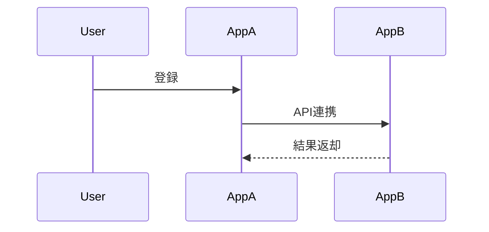

kintone レコード内に記述した Mermaidコードを高解像度でレンダリングし、
拡大・縮小・ドラッグ・全画面表示が可能なビューアプラグインです。

Notion や Miro では扱いづらい 大規模なシーケンス図・ER図を、
kintone 上で快適に閲覧できます。

## 特徴
- ✅ Mermaid v10 対応
- 🔍 ホイールで拡大縮小
- ✋ ドラッグでパン（移動）
- 🖥 全画面表示対応
- 📐 SVGベースのため拡大しても解像度劣化なし
- 🧩 複数フィールド・複数スペース対応
- 🔒 設定ミスを防ぐ重複チェック付き（安全設計）
- 🆓 無料・MIT License

---

## できること
- レコードの 複数行テキストフィールドに Mermaid コードを書く
- 指定した スペースフィールドに図を描画
- 大きな図でも 文字が潰れずに確認可能
- 会議・レビュー・設計確認にそのまま使える

---

## 想定用途
- シーケンス図（業務フロー／連携フロー）
- ER図（アプリ構成・データ構造）
- システム構成図
- kintone アプリ間の関係可視化
- Notion／Miro の代替・補完

---

## 使い方
1. プラグインをインストール
kintone の「プラグイン管理」から本プラグインを追加します。

2. 設定画面でマッピングを作成
以下を設定します。
- Mermaidコードを記述するフィールド
    - 対象：複数行テキストフィールドのみ
- 描画先のスペース
    - フォームレイアウト上の SPACE 要素から選択
- 表示高さ・余白（任意）

### ⚠️ 制約（重要）
- 同じフィールド × 同じスペースは指定できません
- 同じスペースは1回のみ使用可能
    - 複数フィールドを同じスペースに描画すると上書き事故になるため

---

## 3. レコード詳細画面で確認

- 通常表示
→ スペース内に図が描画されます

- 全画面表示
→ 大規模図でも快適に操作可能

- 操作方法
    - ホイール：ズーム
    - ドラッグ：移動

---

## Mermaidコード例

---

## 技術仕様
- Mermaid: v10
- Pan & Zoom: panzoom v9.4.3
- 描画方式: SVG（解像度非依存）
- 対応画面: レコード詳細画面
- 対応フィールド:
    - Mermaidコード：複数行テキスト
    - 描画先：SPACEフィールド

---

## なぜ kintone で Mermaid なのか？
- Notion：拡大縮小が弱い
- Miro：コード管理がしづらい
- 画像貼り付け：解像度が劣化する

👉 「コードはテキストで管理し、図はSVGで見る」
この役割分担を kintone 上で完結させるためのプラグインです。

---

## ライセンス
MIT License
商用利用・改変・再配布すべて可能です。

---

## 作者

NestRec https://github.com/youtotto
kintoneプラグイン／業務改善ツール開発

## 補足
本プラグインは 表示専用です。
Mermaidコードの編集は kintone フィールドで行ってください。
