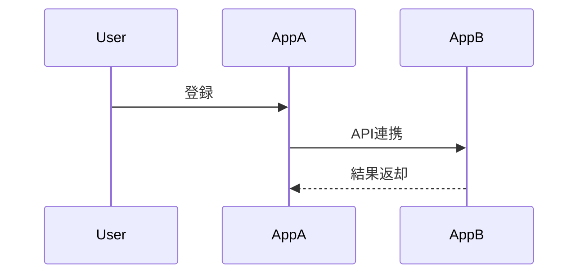

kintone レコード内に記述した Mermaidコードを高解像度でレンダリングし、
拡大・縮小・ドラッグ・全画面表示が可能なビューアプラグインです。

## 公式リンク

- [無料版の配布ページ](https://github.com/youtotto/kintone-Mermaid-Viewer-Plugin)
- [紹介ページ](https://www.nestrec.com/post/kintone-%E3%81%A7-mermaid-%E5%9B%B3%E3%82%92%E3%80%8C%E8%A7%A3%E5%83%8F%E5%BA%A6%E3%82%92%E8%90%BD%E3%81%A8%E3%81%95%E3%81%9A%E3%80%8D%E6%8B%A1%E5%A4%A7%E3%83%BB%E7%A7%BB%E5%8B%95%E3%81%A7%E3%81%8D%E3%82%8B%E3%82%88%E3%81%86%E3%81%AB%E3%81%97%E3%81%9F%E8%A9%B1-%E3%80%9C%E4%BC%9A%E8%AD%B0%E3%81%A7-%E4%BD%BF%E3%81%88%E3%82%8B-%E5%9B%B3%E3%82%92%E7%9B%AE%E6%8C%87%E3%81%97%E3%81%A6%E3%80%9C)

## ダウンロードと導入

[Releases](https://github.com/youtotto/kintone-Mermaid-Viewer-Plugin/releases/latest) から次のファイルをダウンロードします。

| ファイル | 用途 |
|---|---|
| `mermaid-viewer-1.0.1-free-bundle.zip` | 説明書付きの配布用 ZIP（おすすめ）。**ZIP を解凍し、中の `mermaid-viewer-1.0.1-free-plugin.zip` を kintone へ読み込みます。bundle 自体は kintone に直接読み込みません** |
| `mermaid-viewer-1.0.1-free-plugin.zip` | kintone に直接読み込むプラグイン（bundle の中身と同じファイル） |
| `SHA256SUMS.txt` | 上記 ZIP の SHA-256 |

kintone への読み込みは、kintone システム管理 →「プラグイン」→「読み込む」で `mermaid-viewer-1.0.1-free-plugin.zip` を ZIP のまま選びます。

Notion や Miro では扱いづらい 大規模なシーケンス図・ER図を、
kintone 上で快適に閲覧できます。

## 特徴
- ✅ Mermaid v10 対応
- 🔍 ホイールで拡大縮小
- ✋ ドラッグでパン（移動）
- 🖥 全画面表示対応
- 📐 SVGベースのため拡大しても解像度劣化なし
- 🧩 複数フィールド・複数スペース対応
- 🔒 設定ミスを防ぐ重複チェック付き（安全設計）
- 🆓 無料・MIT License

---

## できること
- レコードの 複数行テキストフィールドに Mermaid コードを書く
- 指定した スペースフィールドに図を描画
- 大きな図でも 文字が潰れずに確認可能
- 会議・レビュー・設計確認にそのまま使える

---

## 想定用途
- シーケンス図（業務フロー／連携フロー）
- ER図（アプリ構成・データ構造）
- システム構成図
- kintone アプリ間の関係可視化
- Notion／Miro の代替・補完

---

## 使い方
1. プラグインをインストール
kintone の「プラグイン管理」から本プラグインを追加します。

2. 設定画面でマッピングを作成
以下を設定します。
- Mermaidコードを記述するフィールド
    - 対象：複数行テキストフィールドのみ
- 描画先のスペース
    - フォームレイアウト上の SPACE 要素から選択（グループ内のスペースも選択できます）
- 表示高さ・余白（任意）

### ⚠️ 制約（重要）
- 同じフィールド × 同じスペースは指定できません
- 同じスペースは1回のみ使用可能
    - 複数フィールドを同じスペースに描画すると上書き事故になるため

---

## 3. レコード詳細画面で確認

- 通常表示
→ スペース内に図が描画されます

- 全画面表示
→ 大規模図でも快適に操作可能

- 操作方法
    - ホイール：ズーム
    - ドラッグ：移動
    - ＋ / − ボタン：拡大・縮小
    - 全体表示ボタン：図全体が見える最初の状態に戻す

※ 安全のため、Mermaid は `securityLevel: strict` で動作します。図の中の `click` によるスクリプト実行などは無効です。
※ Mermaid コードに構文エラーがある場合は、その図の枠にエラーが表示されます（他の図はそのまま表示されます）。

---

## Mermaidコード例

```mermaid
sequenceDiagram
  participant User
  participant AppA
  participant AppB

  User->>AppA: 登録
  AppA->>AppB: API連携
  AppB-->>AppA: 結果返却
```

---

## 技術仕様
- Mermaid: v10
- Pan & Zoom: panzoom v9.4.3
- 描画方式: SVG（解像度非依存）
- 対応画面: レコード詳細画面
- 対応フィールド:
    - Mermaidコード：複数行テキスト
    - 描画先：SPACEフィールド

---

## なぜ kintone で Mermaid なのか？
- Notion：拡大縮小が弱い
- Miro：コード管理がしづらい
- 画像貼り付け：解像度が劣化する

👉 「コードはテキストで管理し、図はSVGで見る」
この役割分担を kintone 上で完結させるためのプラグインです。

---

## ライセンス
MIT License
商用利用・改変・再配布すべて可能です。

---

## 作者

NestRec https://github.com/youtotto
kintoneプラグイン／業務改善ツール開発

## 補足
本プラグインは 表示専用です。
Mermaidコードの編集は kintone フィールドで行ってください。
